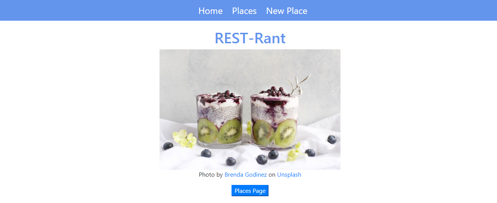

<h1 style="text-align: center">REST-Rant Project</h1>

*Note: This project is not finished yet. The illustrations are a sample of how the app will look like.*

## Description

REST-Rant is an app where users can find restaurants, see what reviews they have, and make their own reviews. This is a Full-Stack project from the Developer Boot Camp at NC State.

## Database

**places** 

| Field | Type |
|-------|------|
| _id | Object ID |
| name | String |
| city | String |
| state | String |
| cuisines | String |
| pic | String |

## Routes

| Method | Path | Purpose |
|--------|------|---------|
| GET | `/` | The home page |
| GET | `/places` | Index page listing all places |
| GET | `/places/new` | New form for a place |
| POST | `/places` | Create a new place |
| GET | `/places/:id` | Show one place in detail (Associated rants, new rant form, delete rant button) |
| GET | `/places/:id/edit` | Edit form for a place |
| PUT | `/places/:id` | Make changes to existing place |
| DELETE | `/places/:id` | Delete a place |
| POST | `/places/:id/rant` | Add rant to a place |
| DELETE | `/places/:id/rant/:rantId` | Delete a rant |

## Tech Used

**Stack:** 
* Express
* NodeJS

**Server-Side Rendering:** 
* JSX

**Node Modules:**
* dotenv
* express-react-views